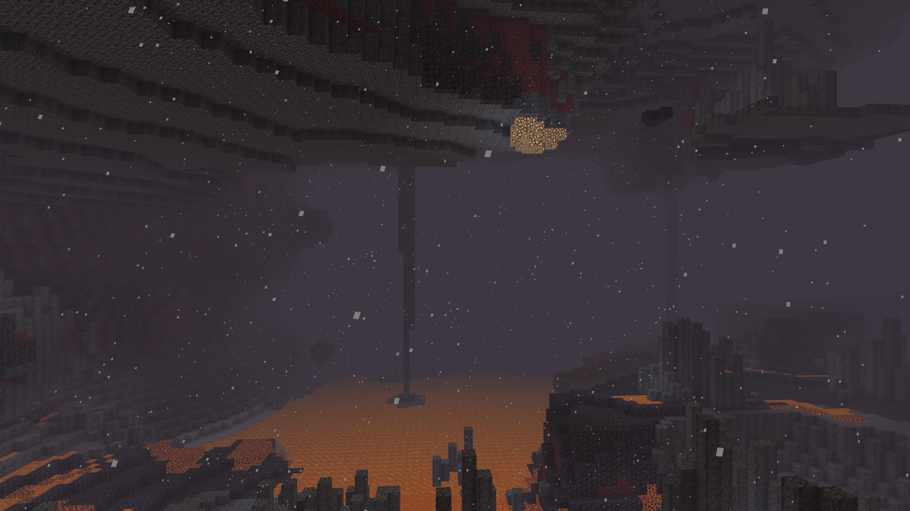
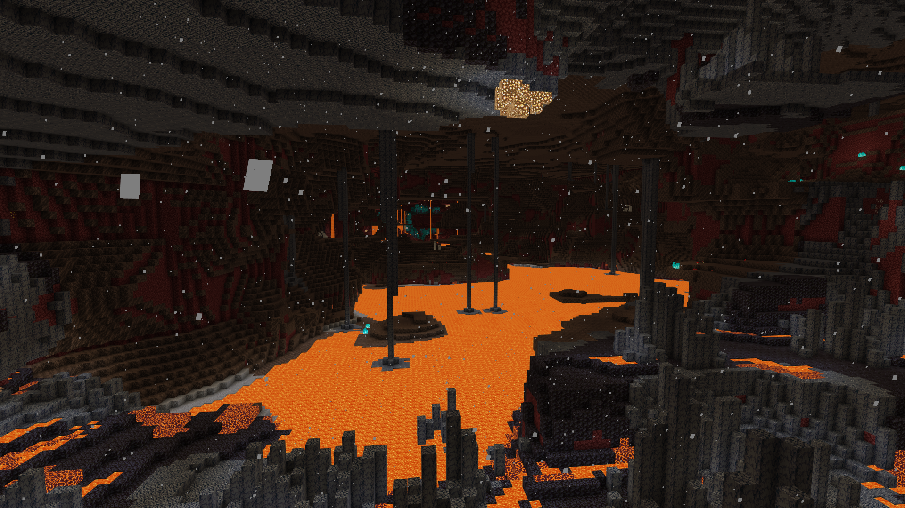

# No Fog

No Fog is a Minecraft Bedrock resource pack that reduces the amount of fog in the nether. This allows you to see the great beauty of the nether!

## Using the pack

### Building from source
* Clone this repository.
* Open the cloned repository in File Explorer.
* Zip the all the contents in the ```nofog``` directory into a file ```nofog.mcpack```. The file extension ```.mcpack``` is important for Minecraft to know what to do with the files.
* Double click the zipped file and it will automatically be loaded into Minecraft.

### Download from release
* On the ```Releases``` tab you can download the latest .mcpack file.
* One the .mcpack file is downloaded, double click it and it will automatically be loaded into Minecraft and then you can use it in your worlds.


## Before and after photos using this pack

### Before using the pack


### After using the pack
